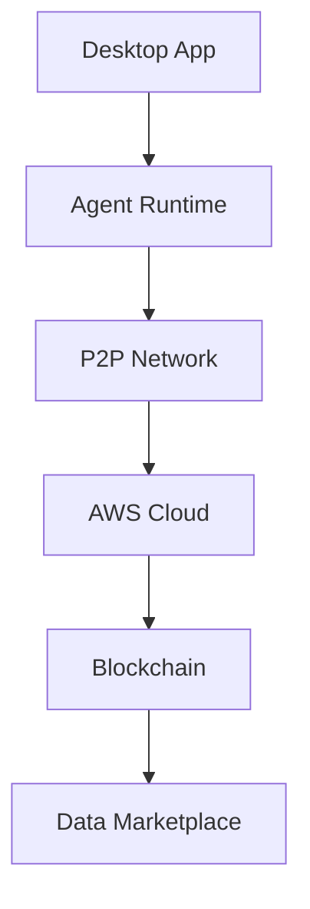

# NeuralMesh 🧠 - Decentralized AI Agent Network

</div>

## 🚀 Vision

NeuralMesh is a revolutionary open-source platform enabling decentralized AI agent interactions and synthetic data generation. Our goal is to democratize AI development through community-driven innovation and transparent governance.

## 🏗️ Architecture



## 🛠️ Tech Stack

| Component | Technology |
|-----------|------------|
| Frontend | PyQt6 |
| Backend | Python 3.9+ |
| Cloud | AWS Services |
| Storage | IPFS + S3 |
| Database | DynamoDB |
| Blockchain | Ethereum |

## 📦 Monorepo Structure

```bash
neuralmesh/
├── apps/                  # Applications
│   ├── desktop/          # Desktop client
│   ├── web/              # Web interface
│   └── mobile/           # Mobile apps
├── packages/             # Shared packages
│   ├── core/            # Core framework
│   ├── agents/          # AI agents
│   └── blockchain/      # Smart contracts
├── infrastructure/       # IaC
│   ├── terraform/       # AWS infrastructure
│   └── kubernetes/      # K8s configurations
├── tools/               # Development tools
└── docs/               # Documentation
```

## 🚀 Quick Start

```bash
# Clone repository
git clone https://github.com/neuralmesh/neuralmesh.git

# Install dependencies
poetry install

# Configure AWS credentials
aws configure

# Start development environment
make dev
```

## 🌐 AWS Infrastructure

```python
# Infrastructure as Code example
from aws_cdk import (
    aws_ec2 as ec2,
    aws_ecs as ecs,
    aws_dynamodb as dynamodb
)

class NeuralMeshStack(Stack):
    def __init__(self, scope: Construct, id: str, **kwargs):
        super().__init__(scope, id, **kwargs)
        
        # VPC Configuration
        self.vpc = ec2.Vpc(self, "NeuralMeshVPC",
            max_azs=2
        )
        
        # ECS Cluster
        self.cluster = ecs.Cluster(self, "NeuralMeshCluster",
            vpc=self.vpc
        )
```

## 🔧 Development

### Prerequisites

- Python 3.9+
- AWS CLI
- Docker
- Poetry
- Make

### Environment Setup

```bash
# Create virtual environment
poetry shell

# Install dev dependencies
poetry install --with dev

# Run tests
pytest

# Format code
black .
```

## 🌟 Features

- 🤖 Decentralized AI Agent Marketplace
- 🔄 P2P Knowledge Sharing
- 💽 Synthetic Data Generation
- 🏦 Built-in Crypto Wallet
- 📊 Real-time Analytics
- 🔐 Privacy-preserving Computing

## 🔐 Security

```python
# Example security configuration
SECURITY_CONFIG = {
    'encryption': 'AES-256',
    'key_rotation': True,
    'audit_logging': True,
    'vpc_endpoints': True
}
```

## 🤝 Contributing

We welcome contributions! See our [Contributing Guide](CONTRIBUTING.md) for details.

### Development Workflow

1. Fork repository
2. Create feature branch
3. Commit changes
4. Submit pull request

## 📚 Documentation

- [Architecture Overview](docs/architecture.md)
- [API Reference](docs/api.md)
- [Deployment Guide](docs/deployment.md)
- [Security Model](docs/security.md)

## 🏗️ AWS Services Used

- AppStream 2.0
- S3
- DynamoDB
- Lambda
- ECS
- CloudWatch
- IAM
- VPC
- Route53

## 🔮 Roadmap

- [x] Project initialization
- [ ] Core framework development
- [ ] Desktop app MVP
- [ ] P2P network implementation
- [ ] Smart contracts deployment
- [ ] Data marketplace launch

## 📈 Performance

```python
PERFORMANCE_METRICS = {
    'agent_response_time': '<100ms',
    'network_latency': '<50ms',
    'transaction_throughput': '1000 TPS',
    'data_sync_time': '<1s'
}
```

## 🌍 Community

- [Discord](https://discord.gg/neuralmesh)
- [Forum](https://forum.neuralmesh.io)
- [Twitter](https://twitter.com/neuralmesh)

## 📄 License

This project is licensed under the MIT License - see the [LICENSE](LICENSE) file for details.

---

<div align="center">

Made with ❤️ by the NeuralMesh Community

[Website](https://neuralmesh.io) -  [Documentation](https://docs.neuralmesh.io) -  [Community](https://community.neuralmesh.io)

</div>

